<p align="center">
  
</p>

<h1 align="center">nba-prediccion-puntos-ml</h1>

<p align="center">
  Primer proyecto de Machine Learning — predicción de puntos por partido en la NBA
</p>

---

## 📋 Descripción

Proyecto de iniciación al Machine Learning que predice los puntos por partido de jugadores NBA en la temporada 2022-23, usando sus estadísticas históricas de temporadas anteriores (1996-2022) como base.

El objetivo es aprender el flujo completo de un proyecto de ML: desde la exploración de datos hasta la evaluación del modelo, pasando por la limpieza, preparación y entrenamiento con varios algoritmos.

---

## 📊 Dataset

- **Fuente:** [NBA Players Data — Kaggle](https://www.kaggle.com/datasets/justinas/nba-players-data)
- **Temporadas:** 1996-97 a 2022-23
- **Jugadores únicos:** 2.551
- **Filas originales:** 12.844

El dataset incluye estadísticas básicas (puntos, rebotes, asistencias) y métricas avanzadas (True Shooting %, Usage %, Net Rating) por jugador y temporada.

---

## 🗂️ Estructura del proyecto

```
nba-prediccion-puntos-ml/
│
├── analisis_nba.ipynb        # Exploración y visualización de datos
├── modelos_nba.ipynb         # Entrenamiento y comparativa de modelos
├── predicciones_nba.ipynb    # Predicciones y evaluación final
│
├── nba_agrupado.csv          # Dataset limpio y agrupado por jugador
├── modelo_rf_optimizado.pkl  # Modelo Random Forest guardado
│
└── README.md
```

---

## 🔍 Notebooks

### 1. `analisis_nba.ipynb`
- Carga y exploración del dataset original
- Heatmap de correlaciones
- Pairplot de las variables más relevantes
- Decisiones sobre qué columnas usar y cuáles descartar

### 2. `modelos_nba.ipynb`
- Agrupación por jugador (medias de temporadas anteriores a 2022-23)
- Construcción de la variable objetivo `pts_22_23`
- Train/test split (80/20)
- Entrenamiento de 4 modelos: Linear Regression, Ridge, Random Forest y XGBoost
- Optimización del mejor modelo con GridSearchCV

### 3. `predicciones_nba.ipynb`
- Predicción sobre todos los jugadores del dataset
- Comparativa predicción vs valor real jugador a jugador
- Análisis de errores y métricas finales
- Visualizaciones: Real vs Predicción, distribución del error y Feature Importance

---

## 🤖 Modelos y resultados

| Modelo | MAE | RMSE | R² |
|---|---|---|---|
| Linear Regression | 2.99 | 3.62 | 0.65 |
| Ridge | 2.99 | 3.62 | 0.65 |
| **Random Forest** | **2.67** | **3.37** | **0.70** |
| XGBoost | 3.25 | 4.06 | 0.56 |

**Modelo ganador: Random Forest** optimizado con GridSearchCV (`max_depth=10`, `min_samples_split=10`, `n_estimators=100`).

---

## 📈 Resultados destacados

- Error medio de **2.59 puntos** sobre todos los jugadores
- El **70.5%** de los jugadores tienen un error inferior a 1 punto
- Error relativo del **26.3%** respecto a la media de puntos (9.86 pts/partido)
- La variable más importante: `pts_media_carrera` (0.78 de importancia)

---

## 🛠️ Tecnologías


---

## ⚠️ Limitaciones

- El modelo predice sobre medias históricas — no tiene en cuenta lesiones, cambios de equipo ni variaciones de rol
- Dataset pequeño (451 jugadores con datos completos de 2022-23)
- Los jugadores jóvenes o con pocos datos históricos tienen mayor error de predicción

---

## 👤 Autor

**Rober** — proyecto de iniciación al Machine Learning
